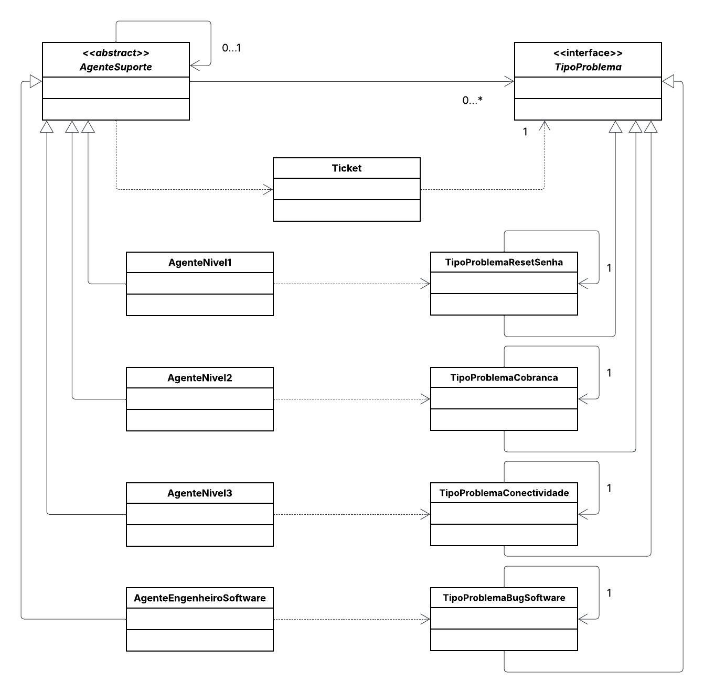

# 🎧 Sistema de Atendimento ao Cliente (Suporte Técnico)

Este projeto implementa **o padrão de projeto comportamental Chain of Responsibility (Cadeia de Responsabilidade)**.
O objetivo é simular **o processamento de uma solicitação (Ticket) por uma cadeia de manipuladores (Agentes de Suporte), onde cada agente decide se pode tratar o problema ou se deve passá-lo ao próximo nível (seu superior)**, além de aplicar o **princípio Open/Closed (Aberto para extensão, fechado para modificação), permitindo adicionar novos níveis de suporte sem alterar os agentes existentes ou o código cliente**.

---
## 📌 Diagrama de Classes

---

## 👩‍💻 Autora

**Eduarda Araujo Carvalho**
